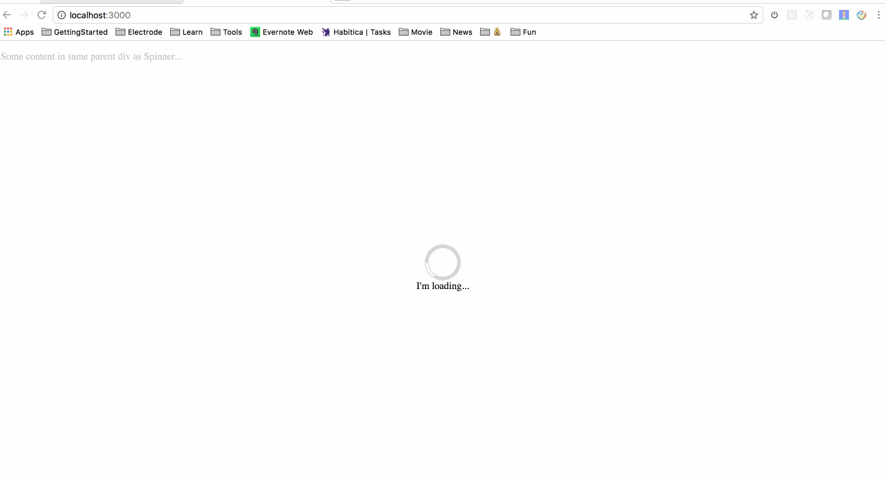

# Discovery Component

A components playground for developing and demoing electrode archetype components.

## Packages

This repo use Lerna to manage multiple related electrode archetype components.

### Spinner Component

[@walmart/wmreact-spinner](https://gecgithub01.walmart.com/OneWalmart/spinner) is a component for loading spinner react component for OneWalmart grocery. It is a general-use loading spinner that uses svg paths.

## Demo Applications

Demo applications can be found under `demo-app` directory, which are used for demoing and developing packages/components. They were created with the Electrode generator and consume the Electrode App archetype modules, which has standardize on common development behavior and patterns.

### Spinner Component Demo

`demo-app/grocery-spinner-demo` is used for demoing and developing `packages/spinner` component.

## Installation

### Prerequisites

Make sure you have installed NodeJS >= 4.x and npm >= 3.x.
```
$ node -v
v6.9.4
$ npm -v
3.10.10
```

### Check it out

To try out this ready made demo app, please clone this app:
```
$ git clone https://github.com/didi0613/discovery-component.git
$ cd discovery-component
$ npm install
$ lerna bootstrap
$ cd demo-app/grocery-spinner-demo
$ npm install
$ gulp dev
```

Now navigate your browser to http://localhost:3000 to see the demo app with @walmart/wmreact-spinner components.



## License

Apache-2.0 © [sheng di](https://github.com/didi0613)

Built with :heart: by [Team Electrode] @WalmartLabs.

[Team Electrode]: https://github.com/orgs/electrode-io/people
[Announcement Blog]: https://medium.com/walmartlabs/introducing-electrode-an-open-source-release-from-walmartlabs-14b836135319#.pwbddxg1z
[Lerna]: https://lernajs.io/
[electrode-archetype-react-app]: packages/electrode-archetype-react-app
[electrode-archetype-react-app-dev]: packages/electrode-archetype-react-app-dev
[generator-electrode]: packages/generator-electrode
